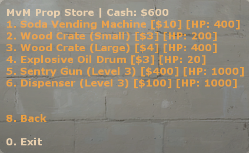

# sourcemod-plugins
A collection of sourcemod plugins I've edited or made from scratch

## Index 📝
 * [[TF2 MvM] Wave Start Announcer](#tf2-mvm-wave-start-announcer)
 * [[TF2 MvM] Shop for spawning props](#tf2-mvm-shop-for-spawning-props-and-entities)
 * [[TF2 MvM] Gift Drops](#tf2-mvm-gift-drops)

### [TF2 MvM] Wave Start Announcer
A simple announcer on wave start, printing out the following string in chat:
```
[MvM] Map: "mvm_mannworks" - Difficulty: "normal" - Wave: 1/6"
```
#### Installing
- Copy [mvm_wave_start_announcer.smx](./compiled/mvm_wave_start_announcer.smx) to `sourcemod/plugins`

Source code: [mvm_wave_start_announcer.sp](./scripting/mvm_wave_start_announcer.sp)

### [TF2 MvM] Shop for spawning props and entities
A shop for players with deep pockets who want to spawn some stuff. Allows for refunding the last spawned item so no hard feelings.



The config file defines available props and entities, their price and health (before they break).

#### How to use
**In chat:** !props & !refund \
**In console:** `sm_props` & `sm_refund`

#### Installing
- Copy [prop_shop.cfg](./configs/prop_store.cfg) to `sourcemod/configs`
- Copy [mvm_prop_shop.smx](./compiled/mvm_prop_shop.smx) to `sourcemod/plugins`

Source code: [mvm_prop_shop.sp](./scripting/mvm_prop_shop.sp)

### [TF2 MvM] Gift Drops
Machines may drop a floating xmas gift when killed. Gifts contain random perks.

#### List of perks available:
 - Infinite ammo (for 30 seconds)
 - Extra Money ($1000)
 - Crit boosted (for 60 seconds)
 - Instakill (for 15 seconds)
 - Speed & Healing (for 60 seconds)
 - Ubercharge / Invincibility (for 30 seconds)

#### Installing
- Install [tf2attributes](https://github.com/LauTrin/TF2Attributes).
- Copy [mvm_gift_drops.smx](./compiled/mvm_gift_drops.smx) to `sourcemod/plugins`
- A config will be generated in `/tf/cfg/sourcemod/mvm_gift_drops.cfg` - Server owners can configure what perks are active, fow how long, gift drop rate, etc. Restart to apply changes.

Source code: [mvm_gift_drops.sp](./scripting/mvm_gift_drops.sp) & everything inside `/scripting/mvm_gifts/*.sp`